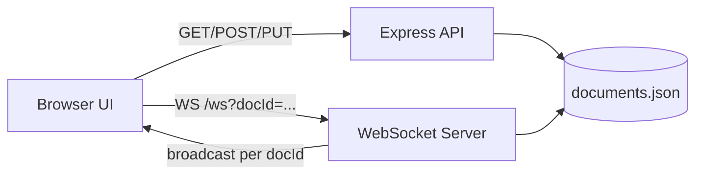

# DocsLite Design Document

## 1. Overview

DocsLite is a lightweight collaborative document editor inspired by Google Docs. It is built as a single Node.js web application that serves both frontend assets and backend APIs, with WebSocket-based real-time updates.

### Goals

- Provide fast document creation and editing in the browser.
- Support basic rich-text authoring with a familiar toolbar.
- Enable near real-time collaboration between multiple users on the same document.
- Keep the implementation simple for educational use (data structures + algorithms focus).

### Non-Goals

- Operational transform (OT) or CRDT conflict resolution.
- User authentication/authorization.
- Multi-tenant access control and sharing permissions.
- Database-backed horizontal scalability.

## 2. System Context

The system has three major parts:

- Browser client (home page + editor page).
- HTTP API server (Express).
- Real-time channel (WebSocket via ws package).

Storage is file-based JSON persisted at `Server/data/documents.json`.

## 3. High-Level Architecture



### Runtime/Deployment Model

- Single process: Node.js server hosts API + static files + WebSocket endpoint.
- Default port: `3000` (or `PORT` env var).
- Frontend delivered from server static root.

## 4. Frontend Design

### 4.1 Pages

- `index.html`: Home/document list + template gallery.
- `Pages/editor.html`: Document editor and collaboration status.

### 4.2 Client Modules

- `js/app.js` (home page logic):
  - Fetches document metadata.
  - Renders recent documents.
  - Provides local title search.
  - Creates new docs from blank/template content.
- `js/editor.js` (editor logic):
  - Loads document by id from query string.
  - Initializes Quill rich text editor.
  - Autosaves document updates with debouncing.
  - Sends/receives WebSocket updates for live collaboration.

### 4.3 UX States

- Home:
  - Loaded list.
  - Empty list.
  - Search-no-results.
  - Backend unavailable banner.
- Editor:
  - Loading.
  - Saved/Saving status.
  - Live collaboration connected/disconnected.
  - Reconnect flow when socket fails.

## 5. Backend Design

### 5.1 API Endpoints

- `GET /api/documents`
  - Returns document list sorted by `updatedAt` descending.
  - Response contains: `id`, `title`, `updatedAt`.
- `POST /api/documents`
  - Creates a new document.
  - Defaults: `title = "Untitled document"`, `content = "<p></p>"`.
- `GET /api/documents/:id`
  - Returns full document (`id`, `title`, `content`, timestamps).
  - Returns 404 if not found.
- `PUT /api/documents/:id`
  - Updates title/content and refreshes `updatedAt`.
  - Returns 404 if not found.

### 5.2 WebSocket Endpoint

- Path: `/ws?docId=<id>`.
- Connection rejected if `docId` missing.
- Message types:
  - `{"type":"content","docId":"...","content":"<html>..."}`
  - `{"type":"title","docId":"...","title":"..."}`
- Server behavior:
  - Validates message docId matches socket docId.
  - Applies update to persisted document.
  - Broadcasts to other clients viewing same doc (not sender).

### 5.3 Keepalive

- Heartbeat every 30s with ping/pong.
- Unresponsive sockets are terminated.

## 6. Data Model

Document schema:

```json
{
  "id": "uuid",
  "title": "string",
  "content": "html string",
  "createdAt": "ISO-8601 timestamp",
  "updatedAt": "ISO-8601 timestamp"
}
```

Collection model:

- Stored as an array in `documents.json`.
- Full file read/write on each request/update.

## 7. Algorithms and Data Structures

### Arrays

- Global document collection in memory after file read.
- Linear operations: search by id, filter by query.

### Hash Map/Object

- Template registry on home page for constant-time template lookup.

### Set

- `wss.clients` manages active WebSocket connections.

### Key Algorithms

- Linear search for document lookup: `O(n)`.
- Sort by updated time for list view: `O(n log n)`.
- Title filter (substring match): roughly `O(n * m)`.
- Debounced save in editor: reduces write frequency.
- Exponential backoff reconnect for WebSocket: bounded retries.

## 8. Consistency and Collaboration Model

Current consistency model is last-write-wins:

- Local edits are autosaved via HTTP PUT.
- Live changes are broadcast over WebSocket.
- Remote content can overwrite local state order depending on arrival timing.

Implications:

- Works well for low-concurrency educational usage.
- Not safe for high-contention collaborative editing where character-level merge guarantees are required.

## 9. Error Handling and Resilience

- Backend unavailable:
  - Home shows retry banner when fetch fails.
  - Editor shows offline/connectivity banner.
- WebSocket disruptions:
  - Editor remains usable (HTTP save still available).
  - Reconnect attempts use exponential backoff up to max attempts.
- Missing/invalid document id:
  - Editor redirects to home or surfaces not-found errors.

## 10. Security Considerations

Current protections:

- Home page escapes document titles before injecting into list HTML.

Known gaps:

- No authentication or authorization.
- No CSRF/session model (public local app assumption).
- Rich HTML content is accepted/stored with minimal sanitization pipeline.
- File-based storage has no encryption or access control.

## 11. Performance Characteristics

Expected to perform well for small data volumes.

Primary bottlenecks at scale:

- Full-file JSON read/write on each mutation.
- `O(n)` lookup/update by id in array.
- Broadcast loop scans all clients then filters by `docId`.

Potential optimizations:

- Introduce in-memory map index (`id -> document`) for faster lookup.
- Use `Map<docId, Set<socket>>` for room-based broadcast.
- Move persistence to a database (SQLite/Postgres) with indexed queries.
- Add write batching or journaling for reduced disk churn.

## 12. Testing Strategy (Recommended)

- Unit tests:
  - `findDocument`, filtering logic, title escaping.
- Integration tests:
  - API create/get/update/list behavior.
  - 404 and malformed input scenarios.
- Real-time tests:
  - Multi-client same-doc broadcast behavior.
  - Reconnect/keepalive behavior under dropped sockets.
- Manual QA:
  - Template creation flow.
  - Concurrent edits from two browser tabs.
  - Offline backend and recovery flows.

## 13. Future Improvements

- Add auth + ownership model.
- Add share links/permissions.
- Replace last-write-wins with OT/CRDT.
- Add version history and restore points.
- Add automated test suite and CI checks.
- Add observability (request logging, metrics, WebSocket diagnostics).

## 14. Runbook

### Local setup

1. `npm install`
2. `npm start`
3. Open `http://localhost:3000`

### Runtime dependencies

- `express`
- `ws`
- Quill loaded via CDN in editor page
